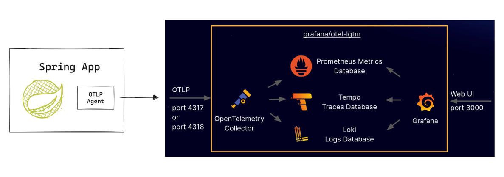
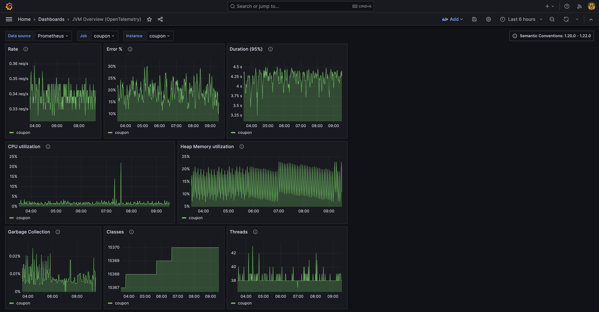
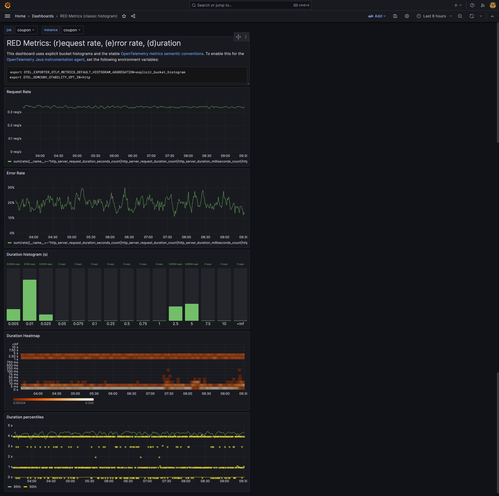
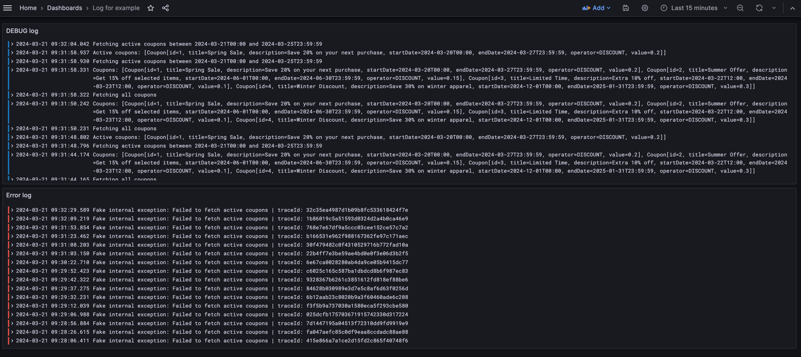
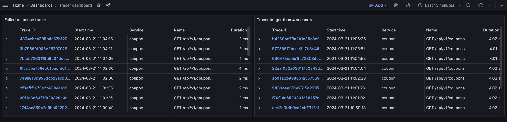
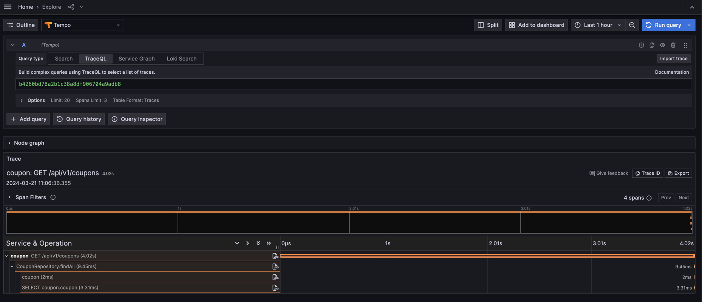

# Spring Boot 3.2 Project template with LGTM stack

Spring Boot project template with OpenTelemetry and LGTM stack.

Blog TH: [Setup โปรเจค Spring Boot 3.3 กับ OpenTelemetry + LGTM stack (โค้ด Template เอาไปใช้กันได้เลย)](https://tpbabparn.medium.com/setup-โปรเจค-spring-boot-3-3-กับ-opentelemetry-lgtm-stack-โค้ด-template-เอาไปใช้กันได้เลย-1bb91dc9f7f5)

Blog EN: [Spring Boot 3.3 + OpenTelemetry (Agent) with otel-lgtm](https://medium.com/@tpbabparn/spring-boot-3-3-opentelemetry-agent-with-otel-lgtm-c9ecb100998e)

## Tech Stack

* Spring Boot 3.3 
* Java 21 
* Gradle 
* PostgreSQL 
* Testcontainer
* OpenTelemetry agent เอาไว้ใช้กับ Collector

## Dashboard from otel-lgtm container

### JVM Overview (OpenTelemetry)

### RED Metrics

## Custom Dashboard

You can get it from /dashboard folder. Just import it to your Grafana

### Logging - Example

### Tracing - Example

